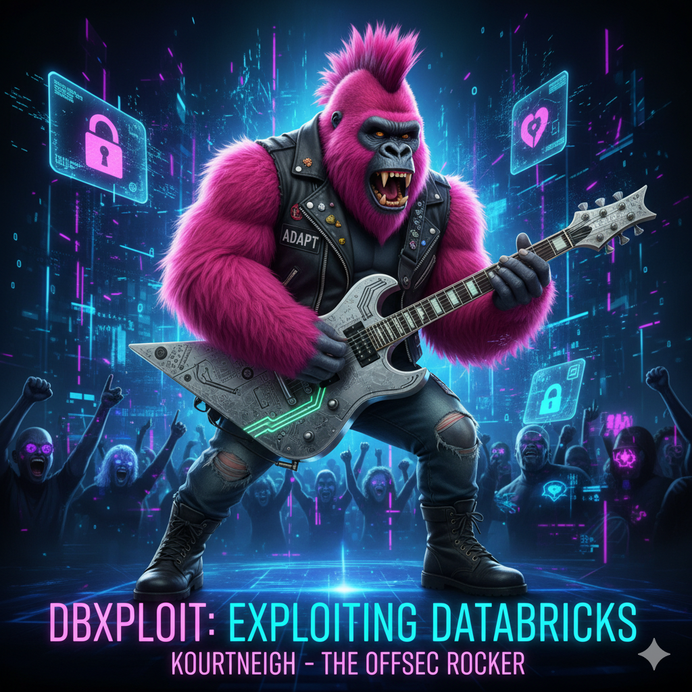

# DBXploit

**DBXploit** is a modular exploitation framework for **Databricks** environments.
It automates reconnaissance, credential abuse, impersonation, and privilege escalation using Databricks-native APIs.

Originally developed during internal security assessments, DBXploit is now a fully weaponized toolkit for **simulating attacker behavior inside compromised Databricks workspaces**.


<p align="center">
  
</p>                                                      
 
---

## 🔍 Features

- ✅ Secret scope and ACL auditing
- ✅ Secret dumping from misconfigured scopes
- ✅ Notebook scanning for hardcoded credentials
- ✅ Identity fingerprinting (token → user mapping)
- ✅ Job-based impersonation and token harvesting
- ✅ Privilege escalation via SCIM (workspace/platform admin)
- ✅ Secret exfiltration via external webhook
- ✅ Workspace scraping and access summaries
- ✅ Token relay, hijack, and pivot simulation
- ✅ CLI-driven with modular core
- ✅ Verbose logging and configurable output

---

## 📁 Project Structure

```plaintext
dbxploit               
├── dbxploit.py
├── config.py
├── core
│   ├── __init__.py
│   ├── access_summary.py
│   ├── impersonate_job.py
│   ├── notebook_scan.py
│   ├── pivot_chain.py
│   ├── privilege_escalation.py
│   ├── recon.py
│   ├── secret_exfiltrate.py
│   ├── secrets_audit.py
│   ├── secrets_dump.py
│   ├── token_hijack.py
│   ├── token_relay.py
│   ├── utils.py
│   ├── whoami.py
│   └── workspace_scraper.py
├── dbxploit.log
```

---

## ⚙️ Setup

### 🔑 Prerequisites
- Python 3
- A valid **Databricks Personal Access Token (PAT)** - Must be Account Admin *(for SCIM features)*:

### 📦 Installation
```bash
git clone https://github.cloud.capitalone.com/CORT/dbxploit.git
cd dbxploit
pip install -r requirements.txt
```

### ⚙️ Configuration

Edit `config.py`:

```python
workspace_url = "https://your-workspace.cloud.databricks.com"
account_id = "1234-5678-ABCD"
token = "dapiXXXXXXXXXXXXXXXXXXXXXXXX"
```

---

## 🚀 Usage

```bash
python3 dbxploit.py
```

You'll be presented with a CLI menu to run modules such as:

```
DBXploit - Databricks Exploitation Framework
==================================================
[1] Audit Secret Scopes and ACLs
[2] Dump Secrets from Accessible Scopes
[3] Scan Notebooks for Hardcoded Secrets
[4] List Jobs, Clusters, DBFS, and Workspace Items
[5] List SCIM Service Principals and Groups
[6] Make User a Platform Admin [REQUIRES ELEVATED PRIVILEGES]
[7] Make User a Workspace Admin [REQUIRES ELEVATED PRIVILEGES]
[8] Submit Impersonation Job (Workspace Admin Required) [REQUIRES ELEVATED PRIVILEGES]
[9] Exfiltrate Secrets to Webhook
[10] Token Relay: Extract and Validate Tokens
[11] Generate Access Summary
[12] Scrape Workspace Content
[13] Replay a Hijacked Token
[14] Automated Privileged Pivot
[99] Show Current Token Identity
[0] Exit
```

---

## 💡 How It Works

- DBXploit interacts directly with the **Databricks REST APIs**, mimicking actions normally performed through the UI or notebook context.
- It can impersonate users by submitting jobs under their identity.
- It leverages **temporary tokens** extracted from notebook contexts to pivot or exfil data.
- SCIM API endpoints allow privilege escalation when valid account-level tokens are used.

---

## 🧪 Future Enhancements

- [ ] Automated STS token extraction from impersonated jobs
- [ ] AWS role assumption + enumeration + privilege escalation
- [ ] GCP and Azure identity support
- [ ] Persistence modules 

---

## ⚠️ Disclaimer

> **This tool is intended for authorized internal security testing only. Do not run this against production environments without proper authorization.**

---

## 📬 Questions / Contributions

For issues, suggestions, or collaboration:
- Open an issue or pull request on the internal GitHub repository
- Or contact me directly:
  - Slack: `@Mohamed` 
  - Email: `mohamed.mrabah@capitalone.com`
